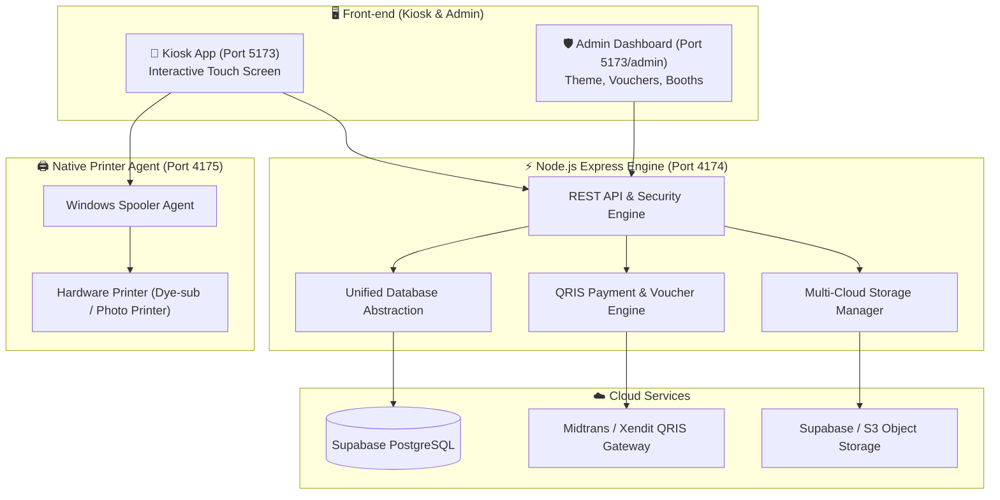

# 📸 PixieBooth — Commercial-Grade Automated Photobooth & Kiosk Ecosystem

[](https://nodejs.org)
[](https://www.typescriptlang.org/)
[](https://react.dev/)
[](https://vitejs.dev/)
[](https://tailwindcss.com/)
[](https://supabase.com)
[](LICENSE)

> **PixieBooth** adalah ekosistem software Photobooth & Kiosk mandiri (*self-service*) kelas komersial yang dirancang untuk bisnis studio foto, event organizer, pernikahan, mall, dan tempat hiburan. Menggabungkan antarmuka Kiosk interaktif berestetika tinggi, sistem pembayaran QRIS otomatis, manajemen voucher dinamis, cetak printer hardware native, hingga Dashboard Admin berbasis Supabase untuk monitoring & kustomisasi real-time.

---

## ✨ Keunggulan Utama (Key Features & Selling Points)

### 📱 1. Antarmuka Kiosk Interaktif & High-Aesthetic UI/UX
- **Multi-Layout Photo Strips**: Pilihan format foto fleksibel (Strip 1x4, Grid 2x2, Single Frame, 1x1, dan kustom).
- **Live Camera Feed & Countdown**: Tampilan kamera real-time dengan efek hitung mundur, petunjuk interaktif, dan fitur retake foto.
- **Studio Photo Editor**: 10+ preset filter warna aesthetic, pilihan frame lucu, stiker/emoji, background kustom, dan preview cetak langsung.
- **Digital Copy via QR Code**: Pengunjung dapat langsung men-scan QR Code di layar Kiosk untuk mengunduh foto digital beresolusi tinggi ke smartphone masing-masing.

### 💳 2. Sistem Pembayaran QRIS Dinamis & Manajemen Voucher
- **Automated QRIS Generation**: Terhubung langsung dengan Payment Gateway (*Midtrans / Xendit / Mock mode*). QR dibuat secara dinamis per transaksi.
- **Server-Side Voucher Engine**: Dukungan kode diskon nominal (Rupiah) maupun persentase (%), kuota pemakaian, dan waktu kedaluwarsa yang diproses aman di server.
- **Instant Webhook Verification**: Sesi foto otomatis terbuka dalam hitungan detik setelah pembayaran terverifikasi tanpa perlu bantuan kasir.

### 🎛️ 3. Dashboard Admin Real-Time & Kustomisasi Tanpa Coding
- **Branding & Theme Engine**: Ubah nama brand, logo emoji, skema warna primary/secondary, dan gambar latar belakang secara langsung.
- **Visual Filter & Frame Builder**: Buat, sesuaikan (brightness, contrast, sepia, hue), dan impor preset filter CSS serta overlay frame baru dari browser.
- **Galeri Foto & Ekspor Data**: Pantau semua hasil sesi foto customer, rekapitulasi data harian, dan ekspor data transaksi dalam format JSON/CSV.

### 🖨️ 4. Integrasi Hardware Printer & Kiosk Watchdog
- **Native Windows Printer Agent**: Agent khusus yang mengomunikasikan pekerjaan cetak langsung ke driver printer fisik (Dye-Sub / Thermal) via PowerShell Spooler.
- **Real-Time Booth Monitoring**: Monitor status koneksi Kiosk (online/offline), sisa antrean cetak, status printer, dan versi aplikasi dari jauh.
- **Auto-Start & Crash Recovery**: Kiosk mode (*Chrome App Mode*) dengan fitur watchdog yang otomatis memulihkan sesi jika aplikasi atau browser tidak sengaja tertutup.

### ⚡ 5. Arsitektur Cloud-Hybrid & Resilience
- **Dual Database (Supabase Postgres & SQLite)**: Pengoperasian terisolasi menggunakan SQLite lokal saat development / offline, dan otomatis sinkron dengan Supabase PostgreSQL saat publikasi.
- **Multi-Provider Cloud Storage**: Dukungan upload gambar ke Supabase Storage, AWS S3, atau Local Object Storage.

---

## 🏗️ Arsitektur Sistem (System Architecture)



---

## 💻 Panduan Menjalankan Aplikasi (Quick Start)

### Prasyarat System
- **Node.js**: v22.0.0 atau lebih baru
- **OS**: Windows 10/11 (direkomendasikan untuk integrasi printer native)
- **Browser**: Google Chrome / Microsoft Edge (mendukung Kiosk Fullscreen Mode)

### 1. Installation
```powershell
# Clone repository ini
git clone https://github.com/yassnath/photobooth.git
cd photobooth

# Install dependensi proyek
npm install

# Salin konfigurasi environment
Copy-Item .env.example .env
```

### 2. Running Development
```powershell
npm run dev
```

Server dan aplikasi akan aktif pada port berikut:
- 📸 **Kiosk App**: `http://localhost:5173`
- 🛡️ **Admin Dashboard**: `http://localhost:5173/admin`
- ⚡ **Backend REST API**: `http://localhost:4174`
- 🖨️ **Printer Agent**: `http://127.0.0.1:4175`

---

## 🧪 Skrip Testing & Validasi

Proyek ini dilengkapi dengan skrip verifikasi otomatis untuk memastikan kualitas kode dan integrasi:

```powershell
npm run typecheck       # Check validasi tipe TypeScript (tsc --noEmit)
npm run build           # Build paket produksi Vite
npm run test:api        # Integration test REST API & Auth Engine
npm run test:supabase   # Test koneksi & PostgreSQL Supabase integration
npm run test:responsive # Test responsive layout Kiosk di Chrome Headless
```

---

## ⚙️ Konfigurasi Environment (`.env`)

| Variabel | Deskripsi | Default |
| :--- | :--- | :--- |
| `DATABASE_DRIVER` | Driver database (`postgres` atau `sqlite`) | `postgres` |
| `DATABASE_URL` | Session Pooler URL dari Supabase | `postgresql://...` |
| `ADMIN_BOOTSTRAP_PASSWORD` | Password pertama kali untuk akun admin | `admin123` |
| `PAYMENT_PROVIDER` | Gateway pembayaran (`mock`, `midtrans`, atau `xendit`) | `mock` |
| `STORAGE_DRIVER` | Lokasi simpan foto (`local`, `supabase`, atau `s3`) | `local` |
| `PRINTER_MODE` | Mode cetak (`windows` atau `spool`) | `windows` |

---

## 🖨️ Mode Kiosk Produksi & Auto-Start

Untuk menjalankan photobooth dalam mode mesin Kiosk mandiri (*unattended kiosk*):

```powershell
# 1. Build aset frontend produksi
npm run build

# 2. Jalankan Kiosk Launcher + Watchdog
npm run kiosk

# 3. (Opsional) Daftarkan ke Windows Startup agar otomatis nyala saat PC dihidupkan
npm run kiosk:install
```

---

## 🛠️ Teknologi yang Digunakan (Tech Stack)

- **Frontend**: React 18, TypeScript, TailwindCSS v4, Framer Motion, Lucide Icons, Vite
- **Backend Engine**: Node.js Express, ES Modules, Scrypt Security, Webhook Signatures
- **Database Layer**: Supabase PostgreSQL (Production) / SQLite (Isolated Dev)
- **Payment Gateway**: Midtrans QRIS Dynamic API & Custom Server-Side Voucher Engine
- **Hardware Control**: Node.js Agent + Windows PowerShell Spooler
- **Deployment & Kiosk**: Chrome App Mode Watchdog & Windows Startup Script

---

## 👨‍💻 Developer & Portfolio Info

Dikembangkan sebagai solusi **Software Photobooth Kiosk Mandiri, Handal, dan Scalable**. Sangat ideal digunakan untuk bisnis franchise photobooth, penyewaan event, wedding booth, maupun integrasi sistem pembayaran mandiri (*self-service kiosk*).

Designed & Built with ❤️ by **[Yassnath](https://github.com/yassnath)**.
