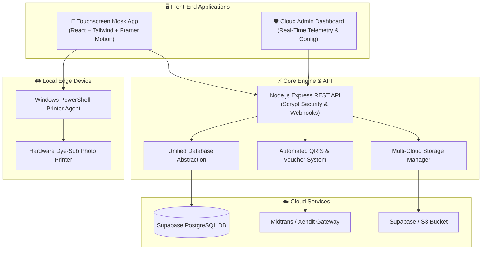

# 📸 PixieBooth — Next-Gen Automated Photobooth & Self-Service Kiosk Ecosystem

 **PixieBooth** is an enterprise-grade, fully automated Photobooth & Kiosk platform engineered for photo studios, weddings, corporate events, retail malls, and entertainment venues. Combining a vibrant, high-aesthetic touch-screen interface with automated dynamic QRIS payments, server-side voucher management, native hardware printing agents, and cloud-synchronized real-time admin monitoring.

---

## 🌟 Key Value Proposition

- 🚀 **100% Unattended Operation**: Seamless self-service flow from payment to photo capture, editing, digital QR downloads, and physical printing.
- 💳 **Instant Dynamic QRIS Payments**: Real-time automated QR payment generation and instant server webhook verification.
- 🎨 **Complete Brand Customization**: Effortlessly modify branding, logo, color palettes, background presets, and custom frames on the fly.
- 🖨️ **Hardware-Level Printer Spooler**: Direct communication with professional dye-sub/thermal printers via native spooler agents.
- ⚡ **Cloud Hybrid Resilience**: Dual-database abstraction (Supabase PostgreSQL + local SQLite failover) ensuring uninterrupted uptime even during network instability.

---

## 🚀 Feature Highlights

### 📱 1. Next-Gen Kiosk Experience (UI/UX)
- **Multi-Layout Photo Strips**: Supports 1x4 strips, 2x2 grids, single frames, 1x1 portraits, and custom layouts.
- **Interactive Live Camera Feed**: Real-time countdown timer, pose guidance, audio feedback, and instant retake options.
- **Studio Photo Editor**: 10+ aesthetic color filters, cute overlay frames, stickers/emojis, custom background colors, and live print preview.
- **Instant Digital Copies**: Instant QR Code generation on the kiosk screen allowing guests to download high-res digital photos directly to their smartphones.

### 💳 2. Smart Payment & Voucher System
- **Automated QR Payment Gateway**: Seamless integration with Midtrans, Xendit, and Mock payment providers.
- **Server-Side Voucher Engine**: Configurable flat-rate or percentage discounts, usage quotas, and expiration tracking managed securely on the server.
- **Instant Webhook Verification**: Auto-unlocks the booth session immediately upon payment confirmation without staff intervention.

### 🎛️ 3. Real-Time Admin Dashboard
- **No-Code Theme Customizer**: Real-time customization of brand name, logo emoji, primary/secondary colors, and background theme presets.
- **Visual Filter & Frame Builder**: Adjust brightness, contrast, hue, and saturation to craft new CSS filter presets or import custom SVG/PNG frame overlays.
- **Photo Gallery & Analytics**: Live monitoring of session histories, captured photos gallery, revenue metrics, and JSON/CSV data export.

### 🖨️ 4. Native Hardware & Kiosk Watchdog
- **Background Printer Agent**: Lightweight Windows agent executing print jobs directly to physical photo printers via PowerShell spooler APIs.
- **Live Fleet Monitoring**: Real-time monitoring of booth connectivity (online/offline), print queue status, paper levels, and app telemetry.
- **Kiosk Watchdog & Auto-Recovery**: Dedicated kiosk launcher enforcing fullscreen app mode with automated crash recovery and state restoration.

---

## 🏗️ System Architecture

---

## 🛠️ Technology Stack

| Domain | Technology / Library |
| :--- | :--- |
| **Frontend UI/UX** | React 18, TypeScript, TailwindCSS v4, Framer Motion, Lucide Icons, Vite |
| **Backend Engine** | Node.js Express, ES Modules, Scrypt Hashing, Webhook Signatures |
| **Database Layer** | Supabase PostgreSQL (Cloud) / SQLite (Edge Failover) |
| **Payment Gateway** | Midtrans / Xendit QRIS API & Custom Server Voucher Engine |
| **Edge Hardware** | Node.js Agent + Windows PowerShell Spooler API |
| **Kiosk Security** | Chrome App Mode Watchdog & Auto-Recovery Launcher |

---

## 👨‍💻 Developer & Portfolio Info

Designed and built as a **Commercial-Grade, Fully Automated Photobooth Software Solution**. Perfect for franchise expansion, event rentals, pop-up installations, and unattended retail experiences.
